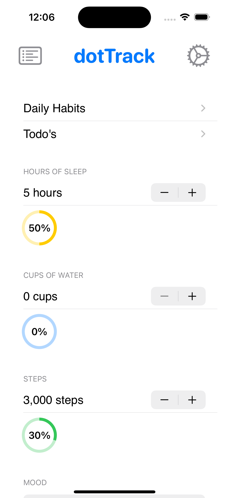
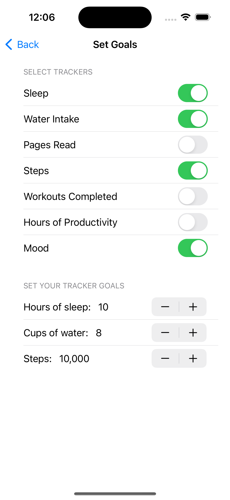
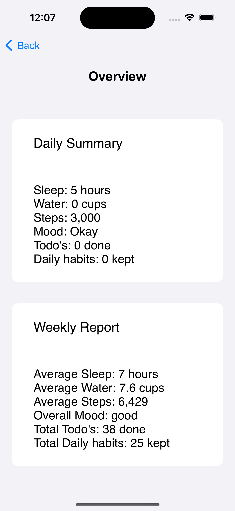
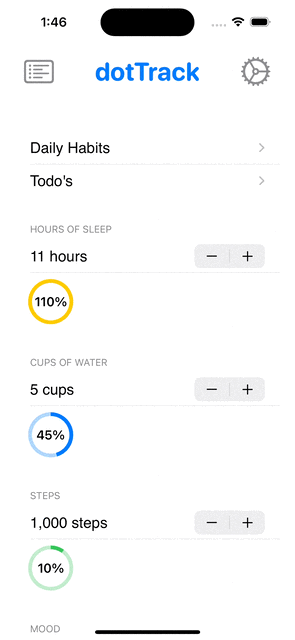

# dotTrack
**A customizable fitness tracker** that offers a simple yet effective way to track your habits and to-dos.

Hi, I'm Luisa, the developer of dotTrack. I created this app because I wanted to focus on building better habits, improving my health, and boosting productivity. Inspired by a growing trend to make the most out of the last three months of the year and how people were struggling to track their progress, I saw the need for a customizable, all-in-one tracker.

  
  
  

### Features
- Track daily fitness habits.
- Manage a dynamic to-do list with tasks you can check off.
- Vizualize what your progress looks like with progress rings and sumamries.
- Persist data between app sessions using UserDefaults, so your progress is always saved.
- Sleek and responsive design.

### Technologies
- Swift UI

### Setup Instructions
1. Clone the repository: `git clone <repo-url>`.
2. Open the project in Xcode.
3. Build and run the app on your iOS simulator or device.

### Next Steps
- Integrate with an API to make weekly sumamries and other improved features
- Adding personalized fitness goal recommendations (using CoreML).
- Implementing reminders for habits and to-dos using Local Notifications.
- Automatically reset daily habits at the start of each day.
- Add a quick tutorial to help new users get started.

### Demo

